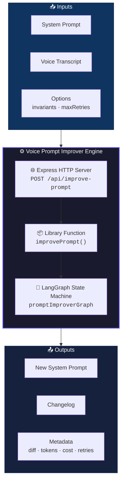
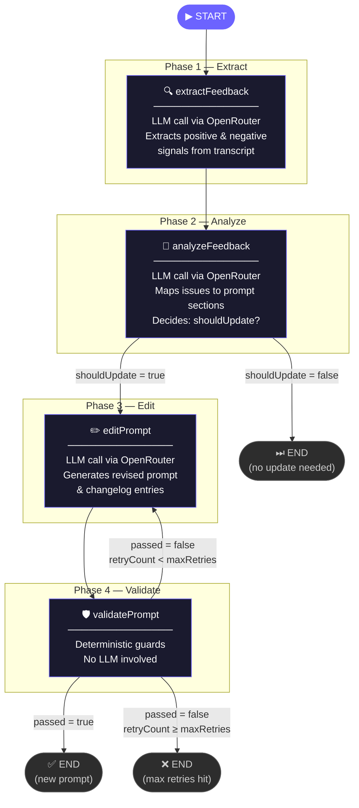
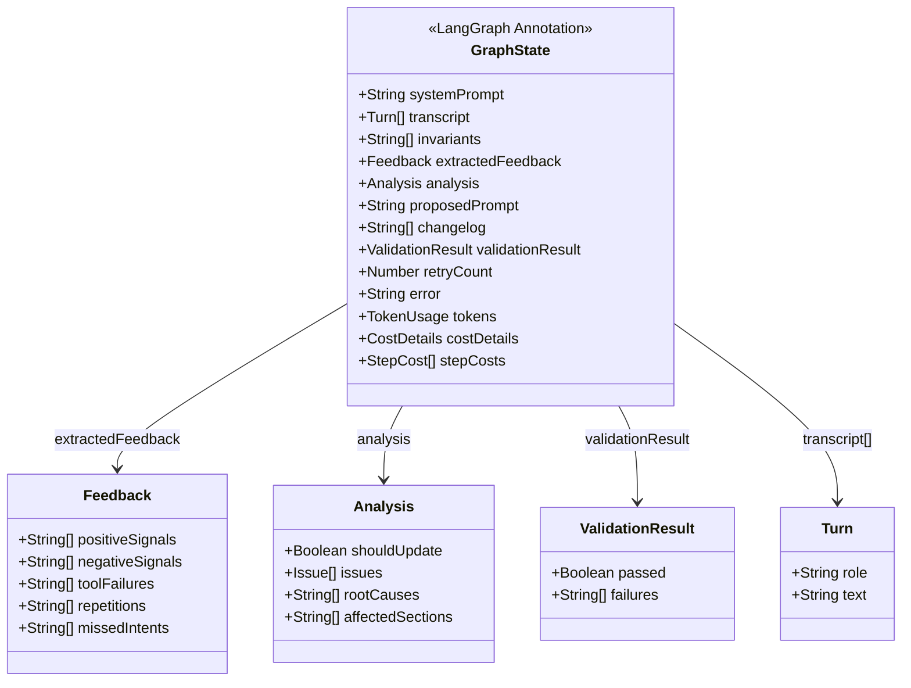
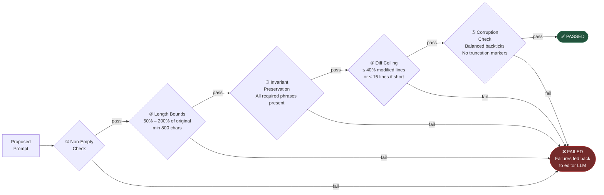
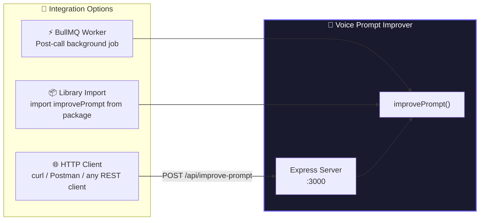

<div align="center">

# 🧠 Self-Improving Agent Prompt

**An autonomous, self-improving prompt evolution engine for AI voice agents**

[](https://www.typescriptlang.org/)
[](https://langchain-ai.github.io/langgraphjs/)
[](https://openrouter.ai/)
[](https://expressjs.com/)
[](https://zod.dev/)
[](./LICENSE)

*Drop it into any backend queue — it watches calls, finds friction, and silently rewrites the prompt to do better.*

</div>

---

## 📖 Overview

**Self-Improving Agent Prompt** is a standalone, production-ready microservice that closes the feedback loop on AI voice agent performance. Instead of relying on manual prompt engineering or explicit user ratings, it autonomously analyzes voice conversation transcripts to detect friction signals, trace them back to root causes in the system prompt, propose targeted edits, and validate those changes through a strict deterministic guard layer — all without human intervention.

Built on a **LangGraph JS state machine**, the pipeline is introspectable, auditable, and modular — making it trivial to integrate into a BullMQ worker, a webhook handler, or any async backend pipeline.

---

## ✨ Key Features

| Feature | Description |
|---|---|
| 🔍 **Autonomous Signal Detection** | Extracts user frustration, confusion, repetition, tool failures, and missed intent directly from transcript patterns — no explicit rating required |
| 🔄 **State Machine Orchestration** | Multi-node LLM and validation logic wired via LangGraph JS for reliable, introspectable execution |
| ♻️ **Recursive Validation Loop** | Deterministic guards reject bad edits and feed failures back to the LLM editor — up to a configurable retry ceiling |
| 🛡️ **Deterministic Guards** | 5 built-in rules ensure every proposed prompt is safe, coherent, and compliant before it's accepted |
| 💰 **Cost & Token Tracking** | Full per-step and aggregate token usage and USD cost reporting via OpenRouter |
| 🧪 **Robust Mock Mode** | Zero-config local execution without an API key — uses high-fidelity, context-sensitive mock responses |
| 🌐 **HTTP API Server** | Ships with an Express server for easy REST integration (`POST /api/improve-prompt`) |

---

## 🏗️ Architecture

### High-Level System Context



---

### LangGraph State Machine — Detailed Flow



---

### Graph State Schema



---

### Deterministic Validation Guards



---

### Integration Modes



---

## 📁 Project Structure

```
voice-prompt-improver/
├── src/
│   ├── index.ts              # Public API — improvePrompt()
│   ├── server.ts             # Express HTTP server
│   ├── config.ts             # Runtime configuration
│   ├── types.ts              # Shared TypeScript types (Turn, ValidationResult)
│   ├── graph/
│   │   ├── index.ts          # LangGraph StateGraph assembly & compilation
│   │   ├── state.ts          # GraphState Annotation schema
│   │   └── nodes/
│   │       ├── extractFeedback.ts  # Phase 1: LLM feedback extractor
│   │       ├── analyzeFeedback.ts  # Phase 2: LLM root-cause analyzer
│   │       ├── editPrompt.ts       # Phase 3: LLM prompt editor
│   │       └── validatePrompt.ts   # Phase 4: Deterministic guard validator
│   ├── prompts/
│   │   ├── extractor.system.md     # System prompt for the extractor LLM
│   │   ├── analyzer.system.md      # System prompt for the analyzer LLM
│   │   └── editor.system.md        # System prompt for the editor LLM
│   ├── services/
│   │   └── openrouter.ts           # OpenRouter API client wrapper
│   ├── schemas/
│   │   └── index.ts                # Zod schemas for Feedback & Analysis
│   └── utils/
│       ├── logger.ts               # Pino structured logger
│       └── parseJson.ts            # Defensive LLM JSON parser
├── tests/
│   ├── unit/                       # Isolated unit tests per node
│   ├── e2e/                        # End-to-end StateGraph traversal tests
│   └── fixtures/
│       └── transcripts/
│           ├── tool_failure.json       # Agent fails to execute a tool
│           ├── repetition_issue.json   # User repeats themselves
│           ├── missed_intent.json      # Agent misses user's goal
│           ├── off_script.json         # Agent goes off-topic
│           └── smooth_call.json        # Successful call (no update)
├── .env.example              # Environment variable template
├── package.json
└── tsconfig.json
```

---

## 🚀 Getting Started

### Prerequisites

- **Node.js** `v20+`
- **npm** `v10+`
- An [OpenRouter API key](https://openrouter.ai/keys) *(optional — Mock Mode works without one)*

### Installation

```bash
git clone https://github.com/mayurasandakalum/self-improving-agent-prompt.git
cd self-improving-agent-prompt
npm install
```

### Configuration

Copy the environment template and fill in your values:

```bash
cp .env.example .env
```

```env
# OpenRouter Configuration
# Get your API key from https://openrouter.ai/keys
OPENROUTER_API_KEY=your_openrouter_api_key_here

# Recommended model choices:
# - anthropic/claude-3.5-sonnet:beta  (Fast, cost-effective)
# - anthropic/claude-3-opus            (Deep reasoning)
OPENROUTER_MODEL=anthropic/claude-opus-4.8

# Logging level: trace | debug | info | warn | error
LOG_LEVEL=info

# Default pipeline constraints
DEFAULT_MAX_RETRIES=1
DEFAULT_TIMEOUT_MS=60000
```

> **💡 Mock Mode**: If `OPENROUTER_API_KEY` is absent or left as the placeholder value, the engine automatically runs in **Mock Mode** — a high-fidelity simulation that exercises every node and validation branch without making any API calls.

---

## 💻 Usage

### As a Library

```typescript
import { improvePrompt } from "voice-prompt-improver";

const transcript = [
  { role: "user",  text: "I need to cancel my reservation." },
  { role: "agent", text: "Sure! What is your account number?" },
  { role: "user",  text: "It's ACCT-123." },
  { role: "agent", text: "I'm sorry, I don't know how to do that." },
];

const originalPrompt = `You are a customer support agent for HotelBookings.
Be polite and assist users with their requests.`;

const result = await improvePrompt(originalPrompt, transcript, {
  invariants: ["customer support agent"],  // These phrases must survive any edit
  maxRetries: 2,                            // Max validation recovery loops
});

// Access results
console.log(result.newPrompt);             // The improved system prompt
console.log(result.changelog);             // Human-readable list of changes
console.log(result.metadata.diff);         // Git-style patch diff
console.log(result.metadata.retryCount);   // How many validation loops ran
console.log(result.metadata.durationMs);   // Wall-clock processing time
console.log(result.metadata.costDetails);  // USD cost breakdown (OpenRouter)
```

### Via HTTP API

Start the server:

```bash
npm run dev
# → Server running on http://localhost:3000
```

Make a request:

```bash
curl -X POST http://localhost:3000/api/improve-prompt \
  -H "Content-Type: application/json" \
  -d '{
    "systemPrompt": "You are a customer support agent. Be polite.",
    "transcript": [
      { "role": "user",  "text": "I need to cancel my booking." },
      { "role": "agent", "text": "I cannot help with that." }
    ],
    "invariants": ["customer support agent"],
    "maxRetries": 2
  }'
```

**Health Check:**

```bash
curl http://localhost:3000/api/health
# → { "status": "healthy", "service": "voice-prompt-improver" }
```

---

## 📊 Response Schema

```typescript
interface ImprovePromptResult {
  newPrompt: string;        // The evolved system prompt (or original if no changes needed)
  changelog: string[];      // List of specific, human-readable edits made

  metadata: {
    extractedFeedback: {    // Phase 1 output
      positiveSignals: string[];
      negativeSignals: string[];
      toolFailures: string[];
      repetitions: string[];
      missedIntents: string[];
    };

    analysis: {             // Phase 2 output
      shouldUpdate: boolean;
      issues: Issue[];
      rootCauses: string[];
      affectedSections: string[];
    };

    diff: string;           // Markdown git-diff patch of the change
    retryCount: number;     // Number of edit→validate loops executed
    durationMs: number;     // Total wall-clock processing time

    tokens?: {              // Aggregate token usage (when not in Mock Mode)
      input: number;
      output: number;
      totalTokens: number;
      cachedTokens: number;
      reasoningTokens: number;
    };

    costDetails?: {         // Aggregate USD cost (when not in Mock Mode)
      totalCost: number;
      upstreamInferenceCost: number;
      upstreamInferenceInputCost: number;
      upstreamInferenceOutputCost: number;
    };

    stepCosts?: StepCost[]; // Per-node cost breakdown
  };
}
```

---

## 🧪 Development & Testing

### Run the Dev CLI

Execute the pipeline against a built-in scenario fixture and trace every step in the terminal:

```bash
# Run against the default tool_failure fixture
npm run run:dev

# Run against a specific fixture
npm run run:dev -- tests/fixtures/transcripts/repetition_issue.json
npm run run:dev -- tests/fixtures/transcripts/missed_intent.json
npm run run:dev -- tests/fixtures/transcripts/smooth_call.json
```

### Testing

```bash
# Run all unit and integration tests
npm test

# Watch mode for TDD
npm run test:watch
```

### Test Coverage Areas

| Layer | Description |
|---|---|
| **Unit** | Deterministic validator rules, defensive JSON parser, each LangGraph node in full isolation |
| **E2E / Integration** | Full StateGraph traversal across all 5 scenario fixtures — happy path, retry loops, and no-update exits |

### Test Scenario Fixtures

| Fixture | Description | Expected Outcome |
|---|---|---|
| `tool_failure.json` | Agent cannot execute a requested action | Prompt updated to clarify tool capabilities |
| `repetition_issue.json` | User repeats themselves multiple times | Prompt updated to improve context retention |
| `missed_intent.json` | Agent misses the user's actual goal | Prompt updated to better align intent resolution |
| `off_script.json` | Agent goes off-topic | Prompt updated with stronger topic-focus constraints |
| `smooth_call.json` | Successful call, no friction detected | **No update** — `shouldUpdate = false`, returns original prompt |

---

## 🔒 Validation Guard Reference

The `validatePrompt` node applies 5 deterministic, LLM-free rules to every proposed prompt:

```
┌─────────────────────────────────────────────────────────────────────┐
│                     Validation Guard Suite                          │
├───┬──────────────────────────┬──────────────────────────────────────┤
│ # │ Guard                    │ Rule                                 │
├───┼──────────────────────────┼──────────────────────────────────────┤
│ 1 │ Non-Empty                │ Proposed prompt must not be blank    │
│ 2 │ Length Bounds            │ 50% ≤ length ≤ 200% of original      │
│   │                          │ (minimum floor of 800 chars)         │
│ 3 │ Invariant Preservation   │ All invariant phrases must appear    │
│   │                          │ verbatim in the proposed prompt      │
│ 4 │ Diff Ceiling             │ ≤ 40% of original lines may change   │
│   │                          │ (≤ 15 lines for short prompts)       │
│ 5 │ Corruption Check         │ Even number of triple-backtick pairs │
│   │                          │ No "...truncated" or "[continued]"   │
└───┴──────────────────────────┴──────────────────────────────────────┘
```

If any guard fails, the failures are serialized and passed back to the editor LLM as constraints for the next retry. After `maxRetries` exhausted attempts, the pipeline exits cleanly and reports all failure reasons.

---

## 🛠️ Tech Stack

| Layer | Technology | Purpose |
|---|---|---|
| **Language** | TypeScript 5.4 | Full type safety throughout |
| **AI Orchestration** | LangGraph JS 0.2 | Stateful, conditional, looping agent graph |
| **LLM Provider** | OpenRouter SDK | Model-agnostic LLM access (Claude, GPT, etc.) |
| **Schema Validation** | Zod 3 | Runtime type enforcement for LLM JSON outputs |
| **HTTP Framework** | Express 5 | REST API server |
| **Diffing** | diff 5 | Git-style patch generation and line diff analysis |
| **Logging** | Pino + pino-pretty | Structured, performant structured logging |
| **Testing** | Vitest + Jest | Unit and E2E testing |
| **Code Quality** | ESLint + Prettier + Husky | Linting, formatting, pre-commit hooks |

---

<div align="center">
  <sub>Built with ❤️ using LangGraph JS and OpenRouter &nbsp;·&nbsp; <a href="https://github.com/mayurasandakalum/self-improving-agent-prompt">self-improving-agent-prompt</a></sub>
</div>
